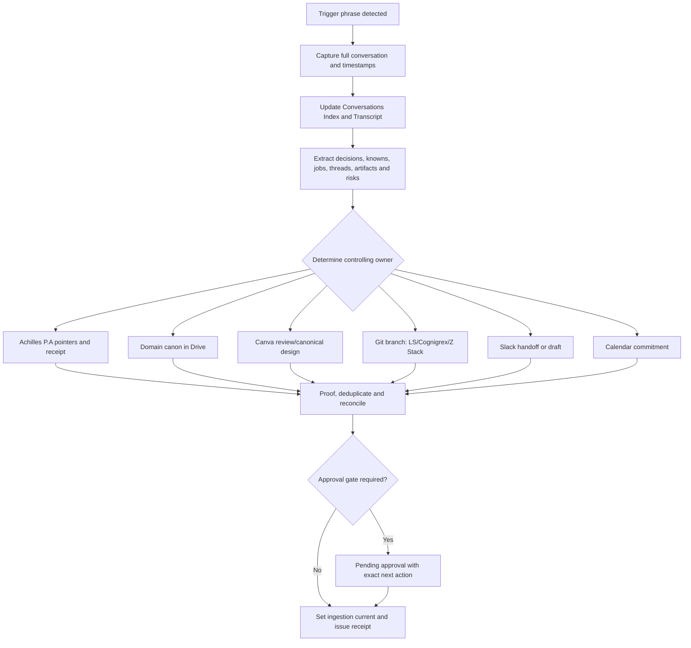

# Conversation Close-Out Skill

## Identity

- **Skill ID:** `conversation-closeout`
- **Version:** `1.0.0-draft`
- **Primary trigger:** `close out this conversation`
- **Trigger matching:** case-insensitive exact phrase occurring either as the complete message or as a grammatically closed sentence within a longer message.
- **Purpose:** convert a completed ChatGPT conversation into a fully traceable, non-duplicative, approval-gated cross-platform handoff and canonicalisation receipt.

## Governing principles

1. The conversation record is provenance and handoff input, not canonical truth.
2. Existing domain-specific canonical workbooks and files retain authority.
3. Consolidation precedes creation. Do not create a new canonical file when an appropriate owner already exists.
4. Preserve source identifiers, URLs, timestamps, ranges, branch names, commit SHAs, artifact IDs and prior/new state.
5. Never claim an external write, export, proof, approval, merge, publication, deployment or deletion unless verified.
6. Public or stakeholder-facing release remains approval-gated.
7. Canva is the canonical design/review surface for publishable visual and document artifacts; Drive stores the approved final source-of-truth export and receipt. Achilles/agent-only operational material does not become Canva canon unless it is a publishable project artifact.
8. Git changes are made on a dedicated branch and remain unmerged until reviewed.
9. Destructive closure, deduplication or deletion occurs only after verified retention and owner approval.
10. Unsupported or inaccessible destinations are recorded as explicit pending actions, never silently omitted.

## Trigger behaviour

When the trigger phrase is detected:

1. Acknowledge that close-out has started.
2. Do not ask the user to repeat information already present in the conversation or corpus.
3. Process the current conversation and relevant linked context in the same response.
4. Continue until all writable, non-destructive close-out actions are completed or explicitly recorded as blocked/pending.
5. Return a close-out receipt with exact writes, unresolved items and the next executable entry point.

## Close-out procedure

### Phase 1 — Capture and integrity

1. Identify or create the stable `Conversation_ID`.
2. Append the current Australia/Brisbane timestamp to `Timestamp_History_AEST` without overwriting earlier timestamps.
3. Capture the complete ordered prompt/response transcript.
4. Preserve interruptions, corrections and superseded assistant statements as provenance.
5. Attach audit notes to the relevant prompt or response cells for:
   - files supplied, viewed, edited, created or exported;
   - tools and connectors used;
   - external actions taken;
   - errors, retries and partial failures;
   - claims that remain unverified.
6. Update `Last_Conversation_Update_AEST` only after capture is complete.

### Phase 2 — Achilles P.A Conversations workbook

Update both mirrored structures in `Achilles P.A — Canonical Workbook v1.0`:

#### A. Conversation Index

Populate or update one row per conversation, including at minimum:

- Conversation ID and timestamp history;
- source surface/account/workspace;
- title, participants and primary domain;
- projects/entities and topics/keywords;
- purpose/context;
- decisions and agreements;
- new knowns, claims and novelties;
- actions and commitments;
- open jobs, threads, questions, holds and dependencies;
- files viewed, edited and created;
- artifacts and exports;
- canonical sources touched;
- intended canonical destinations;
- agents, systems and tools used;
- status and next step;
- confidentiality/release scope;
- DTS/confidence;
- conversation reference;
- latest prompt/response pair number;
- schema version and audit notes.

If a genuinely new structured data type appears, append a new column at the right edge. Leave cells blank when not applicable; use `N/A` only when applicable but unavailable.

#### B. Transcript Matrix

- Mirror index metadata by `Conversation_ID`.
- Append verbatim `Prompt_NN` / `Response_NN` pairs in order.
- Add new prompt/response columns at the right edge only when capacity is exhausted.
- Keep operational metadata in cell notes, not in the transcript text.

#### C. Ingestion state

- Compare `Last_Conversation_Update_AEST` with `Last_Ingested_AEST`.
- Set or verify `NEW`, `UPDATED` or `CURRENT`.
- Set `Last_Ingested_AEST` only after routing and receipt verification are complete.

### Phase 3 — Extract the conversation delta

Produce a deterministic close-out ledger containing:

1. **Decisions** — accepted architectural, operational, scientific, commercial or communication choices.
2. **New knowns and novelties** — facts, hypotheses, terminology, models, schemas or requirements not previously represented.
3. **Changed knowns** — prior state, new state, rationale and evidence.
4. **Open jobs** — actionable work with owner, target surface, dependency, urgency and next executable step.
5. **Open threads** — unresolved reasoning paths, side chats, unanswered questions and pending reviews.
6. **Artifacts** — files, designs, spreadsheets, documents, presentations, PDFs, code, branches, issues, comments, exports and receipts.
7. **Risks and holds** — legal, technical, empirical, ecological, financial, confidentiality and release constraints.
8. **Known unknowns** — unanswered corpus questions that should be returned to the next relevant chat or agent.
9. **Superseded material** — retained references and the new controlling source; do not delete automatically.
10. **Source map** — conversation cells, Drive IDs/URLs, Canva design IDs, Slack channel/thread/canvas IDs, Git repository/branch/path/commit/PR references.

### Phase 4 — Canonical routing

For every extracted item, identify exactly one controlling destination using the current source hierarchy.

#### Drive / canonical workbooks

- Route domain facts, decisions, evidence and operational state into the existing authoritative workbook or document.
- Achilles P.A stores pointers, summaries, derived state and change receipts; it does not duplicate Römer, Eco-X, EMASSC, Cognigrex, FlexiPlate or other domain canon.
- Where the owner cannot be determined, add the item to the relevant consolidation/triage queue with `Owner unresolved` and source references.
- Update longitudinal change logs with timestamp, actor, prior state, new state, confidence and next action.

#### Canva Canon

Use Canva for publishable or reviewable visual/document artifacts associated with projects such as Römer, Eco-X, EMASSC and other external-facing work.

- Locate the existing canonical Canva design before creating a new design.
- Edit or create a review candidate only when the user has authorised the artifact work and the destination is verified.
- Record design ID, title, pages changed, comments, export format and approval state.
- Do not treat internal Achilles, agent routing, raw logs or machine-only control files as Canva canon.
- After proof and approval, export the final artifact to the verified absolute Drive canonical folder and write the export receipt back to the controlling register.

#### GitHub / LS / Cognigrex / Z Stack

- Locate the controlling repository and path.
- Create or update a dedicated branch; do not write directly to the protected canonical branch unless explicitly authorised.
- Update `.md`, schemas, instructions, flowcharts, manifests, code or tests required by the conversation delta.
- Record repository, branch, path, commit SHA, tests, unresolved failures and proposed merge target.
- Open a draft PR when the change is coherent and reviewable; do not merge without approval.
- Preserve LS Desktop as the active compute/test/simulation layer and Drive as canonical storage for approved state/results.

#### Slack

- Search for the relevant project channel, thread or Canvas.
- Update an existing Canvas or prepare a draft message when a human review or cross-team handoff is needed.
- Do not send a new message unless the user has reviewed the wording or explicitly instructed immediate sending.
- Record channel/thread/canvas IDs and links in the close-out receipt.

#### Calendar

- Create or update events only for explicit commitments, deadlines or recurring operating cadences.
- Do not infer deadlines from general discussion.
- Record event IDs and source conversation references.

### Phase 5 — Proof and reconciliation

1. Re-read every modified destination.
2. Verify IDs, timestamps, row alignment, formulas, links, branch state and exported artifact presence.
3. Check for duplicate authority or conflicting canon.
4. Confirm that every extracted item is in one of these states:
   - `Canonical updated`;
   - `Operational queue updated`;
   - `Review candidate created`;
   - `Pending approval`;
   - `Blocked — access/tooling`;
   - `Not applicable`.
5. Calculate or state confidence/DTS and flag anything below the applicable review threshold.
6. Update `Last_Ingested_AEST` only after this reconciliation.

### Phase 6 — Return receipt

Return a concise but complete close-out report containing:

- Conversation ID and close-out timestamp;
- trigger recognised;
- transcript/index update status;
- canonical destinations updated;
- Canva designs and Drive exports changed;
- Git branches, commits and PRs;
- Slack/Calendar changes or drafts;
- open jobs and open threads;
- known unknowns returned from the corpus;
- blocked or approval-gated actions;
- source links/IDs;
- recommended next chat, agent or operating surface;
- final ingestion state and confidence.

## Mandatory approval gates

The skill must not automatically:

- merge a pull request;
- publish or publicly share an artifact;
- send external communications;
- delete or permanently archive files;
- replace an established canonical owner;
- mark empirical, legal, financial, ecological or engineering claims as proven without evidence;
- move a design from review to approved canon;
- close a job whose completion was not verified.

## Minimal-file rule

- Prefer editing the existing canonical owner.
- Create a new file only when no suitable owner exists or when a required format is missing.
- A close-out should normally create no per-conversation handoff document; the Conversations workbook row, transcript row, domain updates and receipts are the durable record.
- Temporary review artifacts must identify their controlling canonical destination and disposal/retention state.

## Failure handling

- Record connector/tool failures in the transcript cell note and close-out receipt.
- Continue with other independent phases.
- Never convert a failed write into a completion claim.
- Where exact transcript export is unavailable, capture all text visible in the active context and mark the omitted range explicitly.
- Where private side-chat retrieval is unavailable, use verified connected sources and list the unresolved retrieval gap.

## Reference architecture

## Canonical status

This skill definition is executable policy only after review and merge into the controlling Operations repository and registration in the current LS/Cognigrex skill index. Until then it is a review candidate and must be reported as such.
